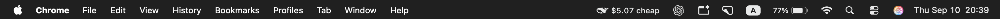
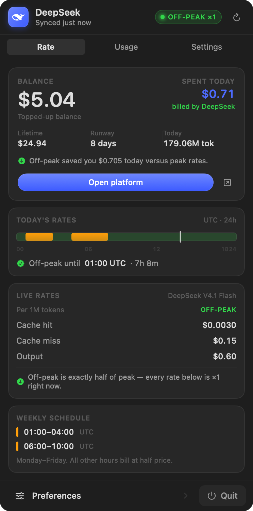
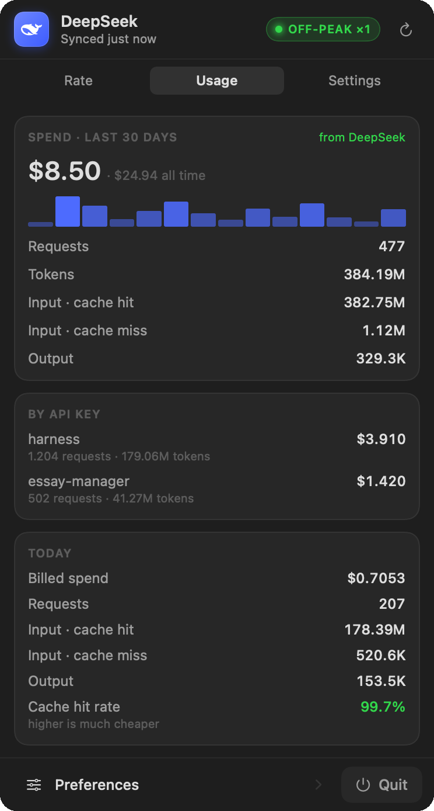

<div align="center">

# DeepSeekBar

**A macOS menu bar app that tells you what DeepSeek is charging you right now — and what you have actually spent.**

[](https://github.com/andreiteodor97/deepseekbar/actions/workflows/ci.yml)
[](LICENSE)
[](#install)
[](#build-from-source)



</div>

<div align="center">

&nbsp;&nbsp;

</div>

---

DeepSeek's API prices depend on the clock: peak hours cost exactly **double**. Nothing in
the API tells you which rate you are on, and the only place your real spend lives is the
console's usage page. DeepSeekBar puts both in your menu bar.

```
🐳 $5.04 cheap
```

Click it for live rates, a peak/off-peak timeline for your timezone, a countdown to the
next price change, and your billed cost and token history.

## What it does

| | |
|---|---|
| **Knows the rate** | Peak is 01:00–04:00 and 06:00–10:00 UTC, Monday–Friday. Off-peak is exactly half. The panel draws your day as a timeline, marks where you are, and counts down to the next switch. |
| **Shows real spend** | Connect your account and it reads DeepSeek's own billed figures: cost per day, request counts, the full token split, and lifetime spend. |
| **Tracks cache hits** | Cached input costs $0.003/M against $0.15/M uncached — a 50× difference. The panel shows today's hit rate next to the spend, because that ratio moves the bill more than anything else. |
| **Quantifies the savings** | It knows the token counts and both rate cards, so it can tell you what today *would* have cost at peak, and what the off-peak window saved you. |
| **Warns you** | Optional notification when the rate flips, so a long job can wait 20 minutes and cost half as much. |

## Install

**Homebrew**

```sh
brew install --cask https://github.com/andreiteodor97/deepseekbar/raw/main/Casks/DeepSeekBar.rb
```

**Download** — grab `DeepSeekBar-<version>.zip` from
[Releases](https://github.com/andreiteodor97/deepseekbar/releases), unzip, and drag
`DeepSeekBar.app` to Applications.

The app is not notarized, so macOS may block the first launch. Either right-click the app
and choose **Open**, or allow it once:

```sh
xattr -dr com.apple.quarantine /Applications/DeepSeekBar.app
```

**Build from source** — no Gatekeeper prompts at all, and the recommended path if you
have the toolchain:

```sh
git clone https://github.com/andreiteodor97/deepseekbar.git
cd deepseekbar
make run
```

Requires macOS 13+ and Xcode command line tools. There are no dependencies: no SPM
packages, no CocoaPods, no Xcode project — just `swiftc` and a handful of files.

### Setup

1. Click the whale → **Settings**, and paste an API key from
   [platform.deepseek.com/api_keys](https://platform.deepseek.com/api_keys). (On first run
   the app also imports one from common local config locations if it finds one.)
2. For billed figures rather than local estimates, open **Usage** → **Connect account**
   and sign in once. See [why that needs a window](#why-connecting-needs-a-sign-in-window).

## Why connecting needs a sign-in window

The console's usage API sits behind an AWS WAF bot check. Without a valid
`aws-waf-token` cookie every request answers `202` with an empty body — plain HTTP clients
cannot get through, and the cookie expires after about four days.

So the app hosts `platform.deepseek.com` in its own `WKWebView` and lets that page solve
the challenge exactly as a browser would. Requests are then issued *from inside* the page,
so the cookie is always present and refreshed by the site's own JavaScript. You sign in
once and the session persists.

Nothing is scraped out of your other browsers, and nothing is sent anywhere except to
DeepSeek.

## Privacy

DeepSeekBar only ever makes **read-only** requests. It never sends a completion request,
never creates or edits API keys, and never touches the payment endpoints. There is no
telemetry, no analytics, and no network traffic to anywhere but `deepseek.com`.

Credentials live in `~/Library/Application Support/DeepSeekBar/credentials.json` with mode
`0600`, alongside `ledger.json` holding your locally observed balance history.

They are deliberately **not** in the keychain. Every local rebuild produces a new ad-hoc
code signature, so the keychain treats each build as a different application and prompts
for your login password on every launch. A file you own with mode `0600` is the same
protection `gh`, `aws`, and `gcloud` rely on.

## How it works

```
Sources/
  Pricing.swift        rate card, peak schedule, formatting      (pure, tested)
  Credentials.swift    0600 credential file + first-run import
  DeepSeekAPI.swift    documented public API
  PlatformAPI.swift    console API through a WKWebView, WAF handling
  Store.swift          polling, ledger, derived figures
  MenuBarLabel.swift   the status item's rendered image
  PanelView.swift      the popover: Rate / Usage / Settings
  Components.swift     cards, mode pill, peak timeline, sparkline
  ConnectConsole.swift sign-in window
  WhaleGlyph.swift     generated by tools/trace_whale.py
```

### The whale is a real vector

A bitmap turns to mush at 16pt, so `tools/trace_whale.py` extracts the silhouette from the
official logo, isolates the outline and the eye, smooths both, and emits a SwiftUI `Path`
in a normalised 16×16 space. The eye is a separate subpath, so the even-odd fill rule turns
it into a cut-out that tints like a native template image.

### Peak schedule

Peak hours are 01:00–04:00 and 06:00–10:00 UTC, Monday through Friday; all other hours bill
at half price. Rates match
[api-docs.deepseek.com/quick_start/pricing](https://api-docs.deepseek.com/quick_start/pricing).

Both current models bill at the `deepseek-flash` card: `deepseek-v4-pro` is being retired
and is served by V4.1 Flash at Flash prices. If DeepSeek changes the card, update `Rate`
and `Schedule.peakWindows` in `Sources/Pricing.swift` and run `make test`.

## Development

```sh
make              # compile
make run          # compile, install to ~/Applications, launch
make test         # rate/schedule test suite
make release      # zip + dmg + checksums + Homebrew cask into dist/
./tools/screenshot.sh   # regenerate the images in docs/
make clean
```

The documentation images are rendered offscreen from the real `PanelView` with sample
data, so they are reproducible and do not depend on a live account or on whatever happens
to be behind the window.

The test suite covers the schedule boundaries (including the weekend edges that are easy
to get wrong), the cost maths, and the formatters. Run it before opening a pull request —
a mis-set weekday means the app confidently reports the wrong price for hours at a time.

See [CONTRIBUTING.md](CONTRIBUTING.md) for the longer version, including how to run the
app against a real account while developing.

## License

[MIT](LICENSE).

DeepSeekBar is an unofficial client. It is not affiliated with, endorsed by, or supported
by DeepSeek. "DeepSeek" and the whale mark belong to their owners; the mark is used here
only to identify the service the app talks to.
